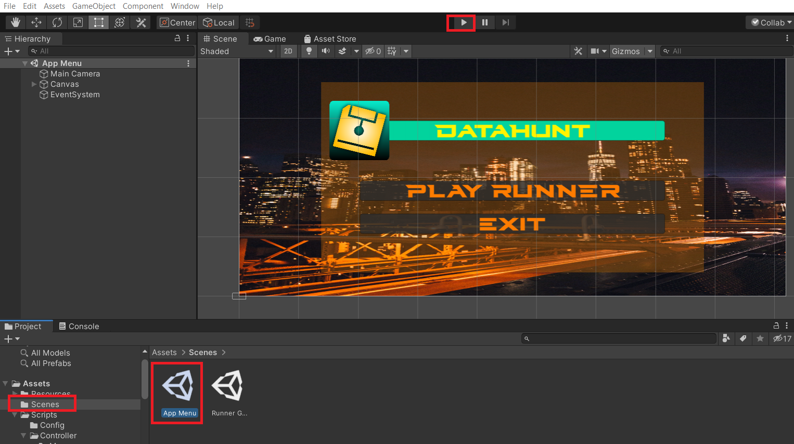
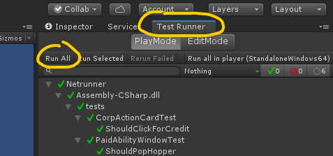
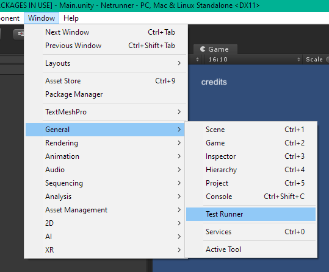

# Developing

Do you want to add a feature? Fix a bug? Experiment with different art? Just play around?

You can use the **power of code™** to do any of that 😎

You'll need:
* a GitHub fork 
* development environment
* some guidance

## Working with GitHub

To get your own copy of the entire codebase, [fork the repo](https://help.github.com/en/articles/fork-a-repo).
To get that copy onto your local computer, [clone](https://help.github.com/en/articles/cloning-a-repository) your fork.
You have all the power over both your loca repo and your fork. You can read, write, branch, force-push, everything.
To contribute some of the awesome Git commits you produced, [open a pull request](https://help.github.com/en/articles/about-pull-requests).
A pull request is a great place to discuss the change, exchange technical details, observations and merge it to the main repo.

## Development environment

### Unity

The project is built upon [Unity](https://unity.com/). The [personal version](https://store.unity.com/download?ref=personal) is perfectly fine.
When you get your Unity Hub downloaded and running, download the [2021.3.4f1](unityhub://2021.3.4f1).
The default's should suffice, no need for additional support packages.
To open the project, just hit the big `Add` button, select the folder you cloned and click onto the project.

### Running

The first time you open the project, you'll have to select the App menu scene:

To run it, press the big "play" button in the middle top.

### Testing

To run tests, go to the `Test Runner` tab and press the `Run All` button:

If you cannot find the tab, you can spawn it from the menu:

## Guidelines

### Coding

Use any editor you want, e.g.: Visual Studio, Visual Studio Code, Monodevelop.

* Follow the MVC architecture to decouple the raw model from inputs (controller) and outputs (view) layers.
* Run tests to quickly check if things are working.

The architecture is still in much flux, as new game mechanics are added. If you have any coding questions or suggestions, please [raise an issue](ISSUES.md).

#### Visual Studio Code
[VS Code has prerequisites for Unity](https://code.visualstudio.com/docs/other/unity#_prerequisites), especially `"omnisharp.useModernNet": false`.

### Assets

Some assets cannot be distributed via this repo, because it's open-source and therefore considered "redistributing" the assets.
Most assets licenses forbid that, even though they can be distributed within the game binary itself.

We can work around that by using placeholders. The placeholders can be overwritten during the release to ship them in-game.
Currently, the `Assets/Nonredist` folder can hold local, non-open-sourced assets.
