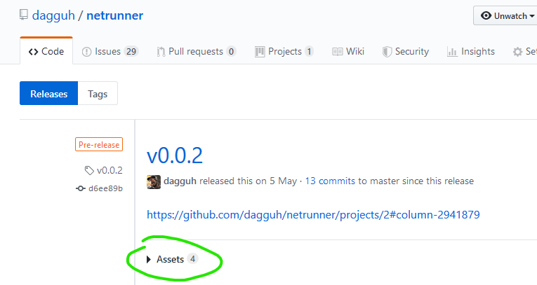
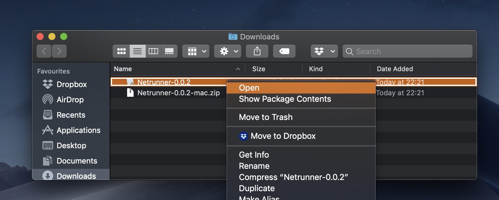
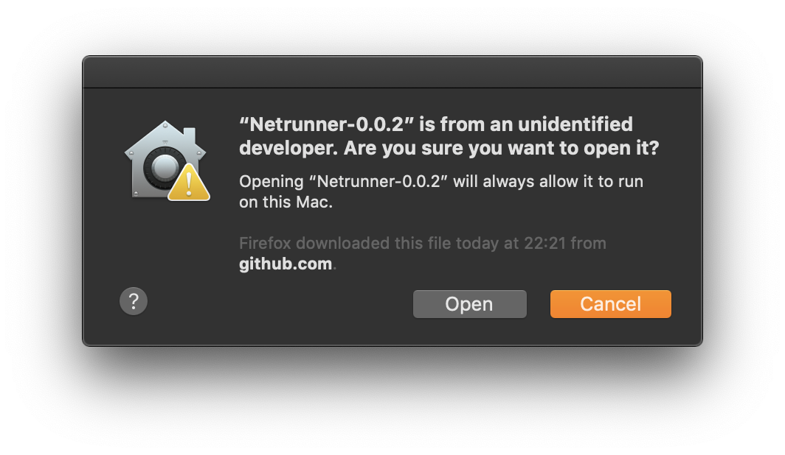

# Playtesting

Playtesting is a great way to guide the project in the right direction.
By playing the game, you can help:
* generate [new ideas](ISSUES.md)
* hunt down [bugs](ISSUES.md)
* find [bad design](ISSUES.md)
* validate good design

## How to play it?

Go to the [releases page](https://github.com/dagguh/netrunner/releases), find the latest release, expand the assets list:

Download and unpack the zip for your operating system.

### Windows

Run the `Netrunner.exe`.
To exit the game, press `Alt`+`F4`.

### Mac

Open the `Netrunner-X.Y.Z.app`.
The first time you open it, you have to open it via contextual menu:

There will be a popup warning the app is from an unidentified developer:

Click `Open` to run the game.
To exit the game, you can swipe between full-screen apps (three fingers sweep by default),
and `Quit` the game from the dock.
