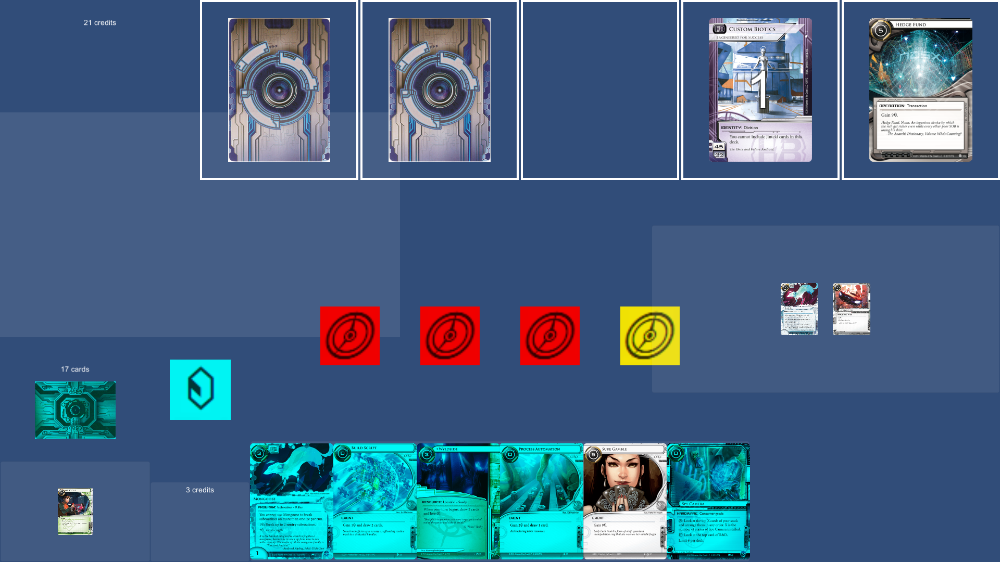

# DataHunt - a digitization of the Netrunner game

Android: Netrunner is a beautiful, rich, satisfying game.

It's biggest problem is a small playerbase.
The paper card collection costs a lot and there's not enough supply.
Current digital game clients are hard to get started on, especially if you never played Netrunner before.

This project aims to bring the Netrunner awesomeness to everyone, who didn't get to experience it yet.

## Design goals

* Enforce game rules. Do not rely on players manually fixing the game state.
* Make GUI controls easy and smooth to avoid input mistakes.
  E.g. avoid designs where a single click performs a game-state-affecting action, especially if the click targets are small and cramped.
  Prefer drag and drop.
* Show all critical information.
  E.g. do not hide remote servers behind a scroll bar.
  Visualize the turn/run structures. Do not rely on asking "action?" every time there's a paid ability window.
* Make the look and feel attractive to new players.
  E.g. expose the great art of Netrunner. Don't make the cards microscopic. Have the ability to zoom in on a card.
  Play cyberpunky sound effects. Have some free space for streamers to put their videocam feed in.
* Be mobile-friendly.
  E.g. do not embed it to browsers, which might be drag-and-drop-unfriendly. Have big click targets. Lay out responsively.
* Educate new players.
  E.g. include visual aids of turn and run structures and progress. Explain why certain plays would be illegal.
  Include beginner decks by default. Consider a simple, short tutorial with a "static" AI.
  Add tutorials.
  Add single-player campaigns.
* Encourage play.
  E.g. Offer matchmaking. Don't require players to pay the emotional and temporal cost of hosting a game. 
  Add leagues/ladder. Visualize the players shifts in performance. Make wins and losses matter.
  Time player interactions. Keep the pace stimulating. Punish AFKers disrespecting the other player's time.
  Add achievements. Promote deck homebrewing and varied play. Promote playing without premature concession.
 * Allow players to make the mistake of accidentally revealing too much information.
  E.g. when the corp tries to play Hard-Hitting News, when the runner didn't run last turn, the card is revealed,
  the corp is explained why they cannot play it and is forced to take the card back. The card has no effect on the game state at all.

## Help build it

You can help build this project! Take a peek at the [contribution guidelines](Docs/CONTRIBUTING.md).
